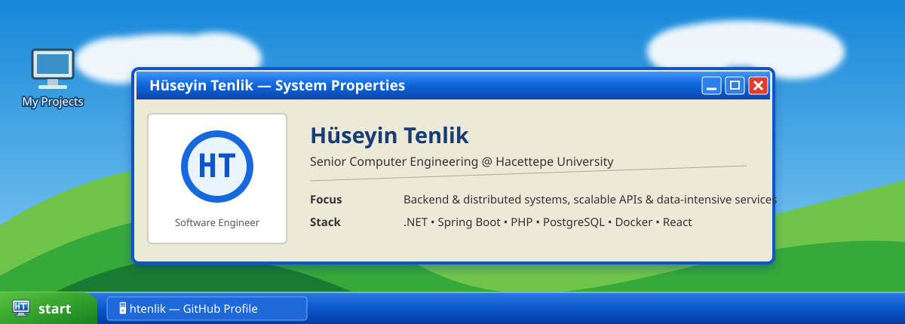

<div align="center">

[](https://htenlik.com)

<br/>

[](https://htenlik.com)
[](https://internship-workflow-management-syst.vercel.app/)
[](https://htenlik.com)

</div>

## `C:\Users\Huseyin\about.exe`

```text
Name       : Hüseyin Tenlik
Education  : Computer Engineering, Hacettepe University
Direction  : Backend engineering → full-stack product delivery
```

I am a computer engineering student who enjoys turning backend logic into software that people can actually open, use and evaluate.

## `C:\Projects\explorer.exe`

<table>
<tr>
<td width="50%" valign="top">

### 🧠 Jotform Hackathon Project

A three-person team project focused on turning raw form analytics into clear, actionable insights.

**Highlights**
- Evidence-based field friction analysis
- Explainable health and confidence signals
- User-friendly AI-generated reporting
- Backend analytics and production data flows

[Open repository →](https://github.com/htenlik/jutform-hackathon)

</td>
<td width="50%" valign="top">

### 🌐 P2P File Sharing

A peer-to-peer networking project exploring direct communication, file transfer and distributed system fundamentals.

**Highlights**
- Peer discovery and communication
- Network programming
- File-transfer workflow
- Distributed architecture fundamentals

[Open repository →](https://github.com/htenlik/P2P-File-Sharing)

</td>
</tr>

<tr>
<td width="50%" valign="top">

### 🏢 Property Management System

A management system built around structured domain modelling and application workflows.

**Highlights**
- Relational data modelling
- CRUD and business operations
- Layered application structure
- Practical management flows

[Open repository →](https://github.com/htenlik/Tasinmaz-Management-System)

</td>
<td width="50%" valign="top">

### 🧩 Systems & Parallel Programming

Coursework and experiments spanning data structures, systems programming and parallel-computing concepts.

**Repositories**
- [BBM204](https://github.com/htenlik/BBM204)
- [MPI Gather Torus](https://github.com/htenlik/MPIGatherTorus)
- [BBM203](https://github.com/htenlik/BBM203)

</td>
</tr>
</table>

---

## `C:\System32\skills.dll`

<div align="center">

### Backend & Application Development


### Data, Frontend & Infrastructure


</div>

---

## `C:\Network\connect.url`

<div align="center">

**Portfolio:** [htenlik.com](https://htenlik.com)  
**GitHub:** [github.com/htenlik](https://github.com/htenlik)  
**Featured live project:** [Internship Workflow Management System](https://internship-workflow-management-syst.vercel.app/)

<br/>

[](https://htenlik.com)

<sub>Designed to feel like my portfolio — engineered to explain what I actually build.</sub>

</div>
